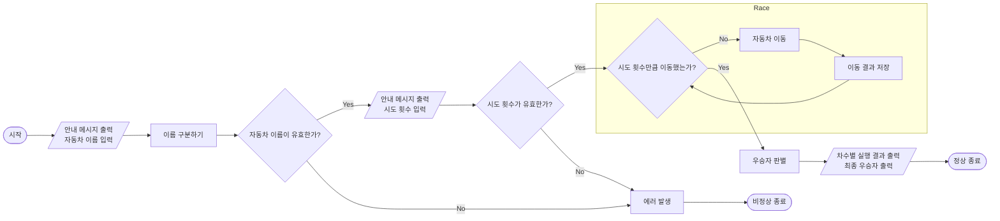

# javascript-racingcar-precourse

## 🚗 기능 목록

### 1. 입출력 기능 (`handle-io`)

- 메시지와 함께 자동차 이름 입력 받기 (`경주할 자동차들의 이름을 쉼표(,)로 구분해서 입력하세요.`)
- 메시지와 함께 이동 시도 횟수 입력 받기 (`이동을 시도할 횟수를 숫자로 입력해주세요.`)
- 이동 결과 배열을 출력하는 함수 (`이름 : 누적 이동거리만큼의 “-”`)
- 최종 우승자를 출력하는 함수 (한명 / 여러명) (`최종 우승자 :` )

### 2. 일반 검증 로직 (`validate-general`)

- 빈 입력인 경우 → `[ERROR]입력된 값이 없어요.`
- 값에 한글, 영문, 숫자, 쉼표가 아닌 문자가 있는 경우 → `[ERROR] 한글, 영문, 숫자, 쉼표(,)만 입력 가능해요.`

### 3. 자동차 검증 로직 (`validate-car`)

- 자동차가 없는 경우 → `[ERROR] 경주할 자동차의 이름을 1대 이상 입력하세요.`
- 자동차 이름이 0자이거나 6자 이상인 경우 → `[ERROR] 자동차 이름은 1자에서 5자 이하로만 가능해요.`
- 자동차 이름 중에 중복된 이름이 있는 경우 → `[ERROR] 자동차들의 이름은 중복될 수 없어요.`

### 4. 이동 숫자 검증 로직 (`validate-count`)

- 숫자가 아닌 경우 → `[ERROR] 이동 시도 횟수를 숫자로 입력해주세요.`
- 정수가 아닌 경우 → `[ERROR] 이동 시도 횟수는 양수인 정수만 가능합니다.`
- 양수가 아닌 경우 → `[ERROR] 이동 시도 횟수는 양수인 정수만 가능합니다.`

### 5. 자동차 클래스 (`car`)

- 이름과 현재 위치 데이터를 가지고 있는 자동차 클래스

### 6. 경주 엔진 (`race-engine`)

- n회동안 이동 - 결과 저장을 반복하고 이동 기록 배열과 우승자 배열을 반환하는 public 메서드
- 각 자동차의 이동 여부 판별
- 이동 결과 업데이트
- 이동 결과 저장

### 7. 경주 컨트롤러 (`race-controller`)

- 입력과 출력, 엔진을 호출하는 public 메서드
- 쉼표를 기준으로 자동차 이름 분리해서 자동차 객체 생성

### 8. 커스텀 에러 (`error`)

- `[ERROR]` prefix를 가지는 에러 메시지를 생성하는 클래스

## 🏁 체크리스트

- [x] indent(인덴트, 들여쓰기) depth를 3이 넘지 않도록 구현한다. 2까지만 허용한다.
- [x] 3항 연산자를 쓰지 않는다.
- [x] Jest를 이용하여 정리한 기능 목록이 정상적으로 작동하는지 테스트 코드로 확인한다.

## 🌠 flow chart



## 📁 디렉토리 구조

```
.
├── __tests__
└── src
    ├── App.js
    ├── RaceController.js             // 메인 경주 컨트롤러
    ├── index.js
    ├── model
    │   ├── Car.js                    // 개별 자동차 데이터 관리
    │   └── Race.js                   // 경주 데이터 관리
    ├── utils                         // 유틸리티 모듈
    │   ├── CustomError.js
    │   └── test                      // 테스트용 유틸리티
    ├── validator                     // 입력값 검증용 모듈들
    │   ├── carNameValidator.js       // 자동차 이름 검증
    │   ├── checkRuleSet.js           // 규칙 세트 검증 유틸리티 함수
    │   ├── generalValidator.js       // 입력 일반 검증
    │   └── moveCountValidator.js     // 이동 횟수 입력 검증
    └── view                          // 입출력 처리
        ├── Input.js
        ├── Output.js
        └── index.js
```

## ✅ 테스트 결과


